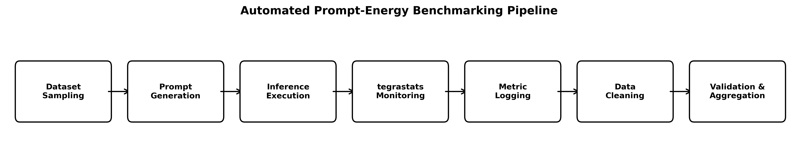
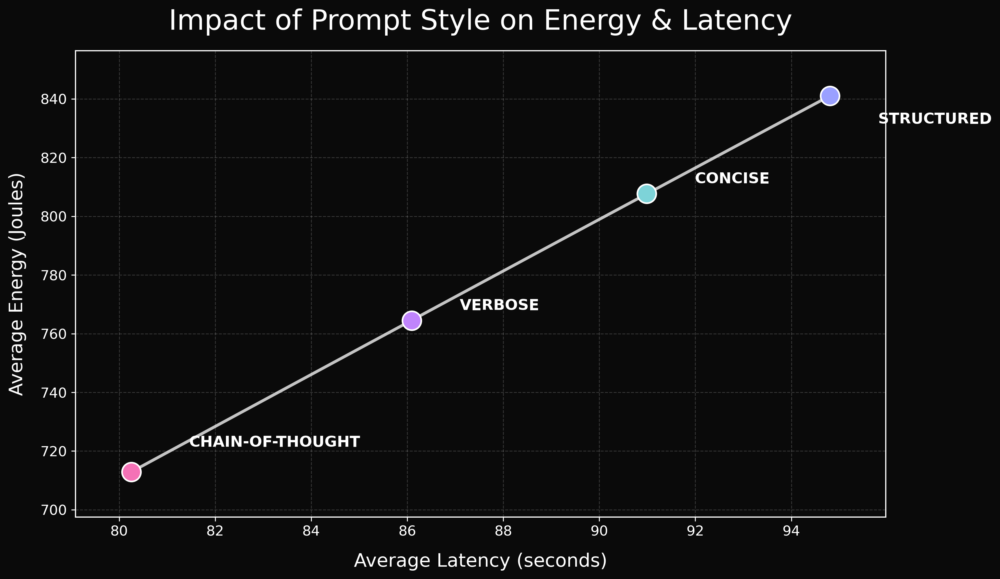
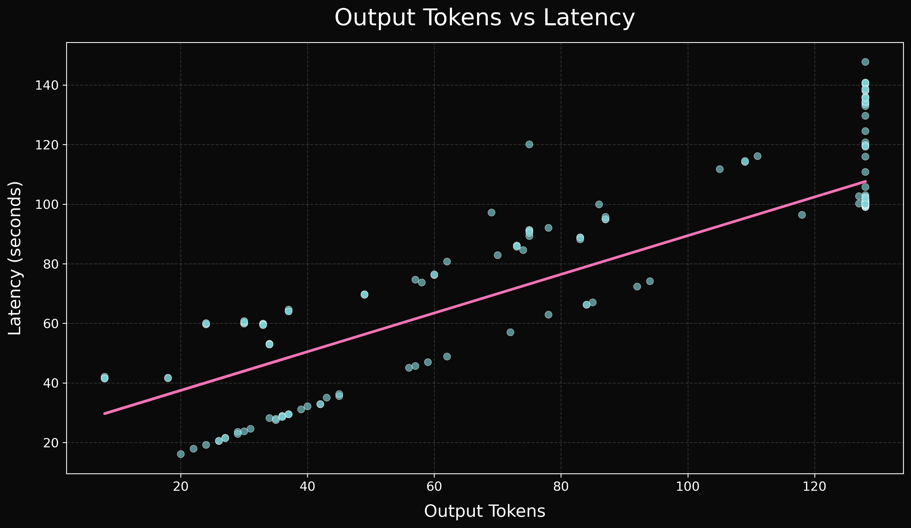
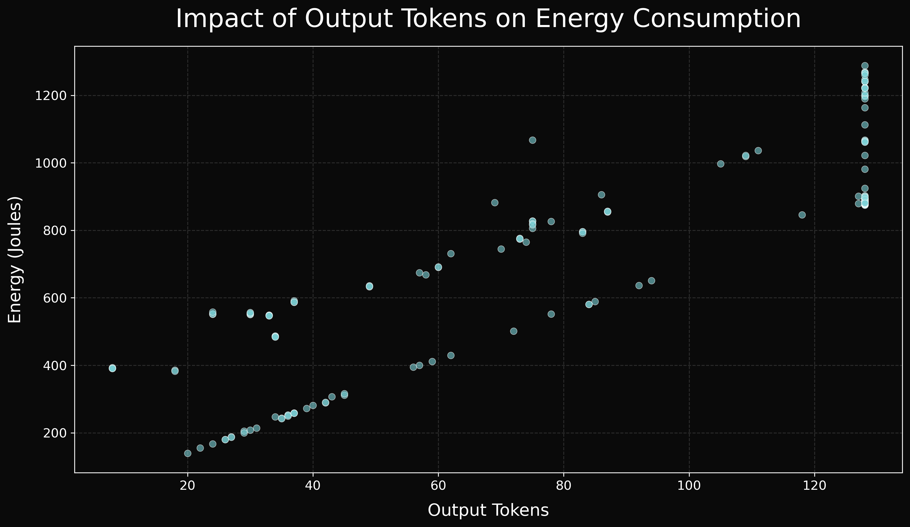

# Energy Implications of Prompt Design in Edge-Based LLM Inference

## Abstract
This research is a continuation of my prior practicum project, which was an analysis of Large Language Model (LLM) inference energy efficiency, is the basis of this research. Previously benchmark demonstration on open and closed LLM’s on AWS cloud GPU infrastructure (L4 & A10G) resulted that prompt optimization can lower energy usage by up to 40% on cloud hardware without degrading any output quality. This current project aims to follow more towards resource-constrained edge computing, particularly on an NVIDIA Jetson Orin Nano device. Main research question is: Does the structural design of a user prompt varying in length, specificity, and reasoning strategy yield a statistically significant difference in energy consumption during LLM inference on an NVIDIA Jetson Nano. For this a controlled environment under TinyLlama-1.1B was used as the primary quantized model. Testing was done under four prompt styles: Structured, Concise, Verbose and Chain-of-Thought and evaluated across three benchmark categories: Q/A, Reasoning and Summarization. A modular automated pipeline was developed for dataset sampling, controlling the prompts, execution, cleaning, auditing and metric logging across runs. The main collection of metrics are Input/Output Tokens, Latency, Power and Total energy. An energy prediction model (a pre/post-regression model based on the use of prompts) has been established be improve our understanding of these patterns as to their influence on energy consumption. Additionally, exploratory analysis of prompt style, token count, latency and energy were performed. Prompt styling was found to indirectly influence energy through length and/or run time; however, latency was found to be the primary predictor of consumption. These findings back up previous assumptions regarding prompt design and its effect on energy consumption demonstrating that prompt design affects energy indirectly rather than from any other direct structural differences.

---

## Executive Summary
AI applications are becoming much more common on devices right at the “edge of the network” (like smart devices, things in the Internet of Things, built-in systems, and phones), that is why there is really a need to understand and reduce how much power language models use when they’re running on devices with limited resources.

This project directly extends from previous cloud-based experiments and transitions towards edge-based LLM inference using NVIDIA Jetson Orin Nano.

The main goal of this research is to answer the question of whether the structural design of a user prompt varying in length, specificity, and reasoning strategy yield a statistically significant difference in energy consumption during LLM inference on edge hardware or are they deviant towards secondary runtime factors like latency and output tokens.

---

## Project Objectives
- Evaluate four prompt styles:
  - Structured
  - Concise
  - Verbose
  - Chain-of-Thought
- Benchmark across:
  - Question Answering
  - Reasoning
  - Summarization
- Measure:
  - Input Tokens
  - Output Tokens
  - Latency
  - Average Power
  - Total Energy Consumption
- Build predictive regression models for energy forecasting

---

## Hardware & Model Environment
- **Device:** NVIDIA Jetson Orin Nano
- **Model:** TinyLlama-1.1B-Chat-v1.0
- **Runtime:** Ollama
- **Power Monitoring:** NVIDIA tegrastats
- **Programming Language:** Python
- **Analysis Libraries:** Pandas, NumPy, Scikit-learn, Matplotlib, Plotly

---

## Benchmark Datasets

| Dataset | Task Type | Purpose |
|---------|-----------|---------|
| REPLIQA | Question Answering | Factual response generation |
| MultiHopQA | Reasoning | Multi-step logical inference |
| CCSum | Summarization | Long-form summarization |

---

## Prompt Styles

| Prompt Style | Characteristics |
|--------------|------------------|
| Concise | Minimal direct instructions |
| Structured | Explicit formatted task guidance |
| Verbose | Expanded contextual prompting |
| Chain-of-Thought | Step-by-step reasoning guidance |

---

## Experimental Pipeline


---

## Key Visualizations

### Impact of Prompt Style on Energy & Latency


### Output Tokens vs Latency


### Output Tokens vs Energy Consumption


---

## Key Findings & Insights
These findings clearly enhance our understanding of how prompt style affects energy consumption on edge hardware LLM inference. While initial hypothesis was that energy would directly be impacted by prompt style, it was clearly changed due to the results that showed prompt styles affects energy consumption indirectly through runtime factors like output tokens generation and latency.

Structured prompting used 18% more energy with 841 Joules of energy when compared to any other prompting style in the benchmarking suite.

It also confirmed that the output length was one of the key factors.

Latency lasted to be the stronger predictor of energy.

### Systems-Level Relationship:
```text
Prompt Style → Output Tokens → Latency → Energy Consumption
```

---

## Regression Modeling Results

### Pre-Inference Model:

    - Weak predictive score
    - Prompt structure alone is insufficient for strong prediction

### Post-Inference Model:

    - Near-perfect predictive score
    - Latency and output tokens dominate energy forecasting

---

## Repository Structure

```text
Practicum-2/
│
├── README.md
├── LICENSE
├── requirements.txt
├── .gitignore
│
├── report/
│   ├── .gitkeep
│   └── UED_Practicum_2_Report.pdf
│
├── presentation/
│   ├── .gitkeep
│   ├── P2_PPT.pdf
│   └── P2_PPT.pptx
│
├── notebooks/
│   ├── .gitkeep
│   ├── Correlation_analysis.ipynb
│   └── Visualizations.ipynb
│
├── figures/
│   ├── .gitkeep
│   └── figure1_pipeline.png
│
├── data/
│   ├── audit/
│   │   ├── .gitkeep
│   │   ├── raw_preview.csv
│   │   ├── clean_preview.csv
│   │   └── cleaning_summary.csv
│   │
│   ├── raw/
│   │   ├── .gitkeep
│   │   └── raw_runs.csv
│   │
│   ├── processed/
│   │   ├── .gitkeep
│   │   └── clean_runs.csv
│   │
│   └── samples/
│       ├── .gitkeep
│       ├── REPLIQA_sampled.csv
│       ├── MultiHopQA_sampled.csv
│       └── CCSum_sampled.csv
│
├── outputs/
│   ├── models/
│   │   ├── .gitkeep
│   │   ├── pre_run_best_model.joblib
│   │   ├── pre_run_results.csv
│   │   ├── post_run_best_model.joblib
│   │   └── post_run_results.csv
│   │
│   └── plots/
│       ├── .gitkeep
│       ├── Impact_of_Prompt_Style_on_Energy_&_Latency.png
│       ├── energy_regression_coefficients_dark.png
│       ├── linear_regression_coefficients_dark.png
│       ├── model_comparison_r2_dark.png
│       ├── output_tokens_vs_energy_dark_energy_consumption.png
│       ├── output_tokens_vs_latency_dark.png
│
└── src/
    ├── .gitkeep
    ├── config.py
    ├── utils.py
    ├── prompt_templates.py
    ├── model_backend.py
    ├── energy_logger.py
    ├── dataset_adapters.py
    ├── run_experiments.py
    ├── clean_data.py
    ├── data_audit.py
    ├── train_models.py
    └── run_pipeline.py

## Installation

```text
git clone https://github.com/emmaniuel26/Practicum-2.git
cd Practicum-2
pip install -r requirements.txt
```


## Running the Pipeline
```text
python src/run_pipeline.py --stage all
```


## Individual Stages
```text
python src/run_pipeline.py --stage sample
python src/run_pipeline.py --stage run
python src/run_pipeline.py --stage clean
python src/run_pipeline.py --stage audit
python src/run_pipeline.py --stage train
```


## Citation
If you find this project useful and would like to reference this project, please cite:
```text
@mastersthesis{dammu2026promptenergy,
  author       = {Uttam Emmaniuel Dammu},
  title        = {Energy Implications of Prompt Design in Edge-Based LLM Inference},
  school       = {Regis University},
  year         = {2026},
  type         = {MSDS Data Science Practicum II},
  address      = {Denver, Colorado, USA}
}
```


## Regis Portfolio

https://regisportfolio.com/profiles/udammu/udammu.html

---

## Author

- Uttam Emmaniuel Dammu
- MSDS 696 – Data Science Practicum II
- Regis University
- Spring 2026

---

## License

MIT License
